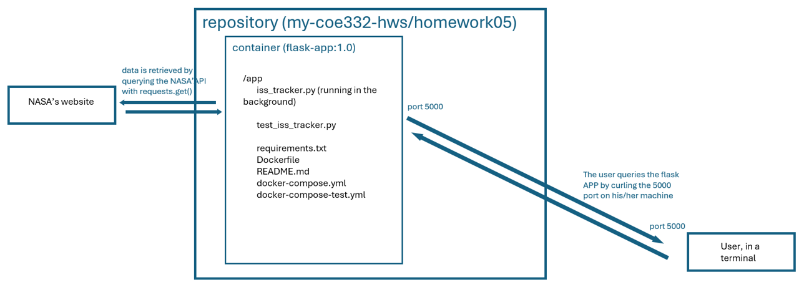

# ISS tracker

## What does the code in this folder achieve ?
This program retrieves position and velocities data of the ISS from the following NASA's website : <https://nasa-public-data.s3.amazonaws.com/iss-coords/current/ISS_OEM/ISS.OEM_J2K_EPH.xml>. Then, the program starts a flask app, whose routes returns informations on the dataset. The following routes are present :

| Route                           | What it does                                                                 |
|--------------------------------|-------------------------------------------------------------------------------------|
| `/epochs`                      | Return entire data set                                                             |
| `/epochs?limit=int&offset=int` | Return modified list of Epochs given query parameters                             |
| `/epochs/<epoch>`              | Return state vectors for a specific Epoch from the data set                       |
| `/epochs/<epoch>/speed`        | Return instantaneous speed for a specific Epoch in the data set (math required!)  |
| `/now`                         | Return state vectors and instantaneous speed for the Epoch that is nearest in time |

## How to use this project

### General overview
No need to download a data set, it will be carried out in the script. First, build the image from the Dockerfile `Dockerfile`. To run the containerized unit tests, use the `docker-compose-test.yml` file. To launch the flask app that you can query, use `docker-compose.yml`. 



### How to build the image
In the repository `homework05`, type
```
docker build -t flask-app:1.0 ./
```

### How to run the containerized unit tests
In the repository `homework05`, type
```
docker compose -f docker-compose-test.yml up
```
and pytest will launch automatically.
### How to run the containerized code
In the repository `homework05`, type
```
docker compose -f docker-compose.yml up -d
```
and then you can start curling the flask app with
'''
curl localhost:5000/<your route>
'''

## AI usage
Through the completion of this homework, AI was extensively used, and only used, to answer basic syntax questions or understanding and dealing with error messages.
